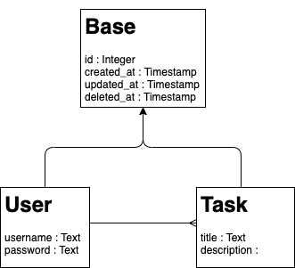

# todoAPI

Basic todo RESTful API Engine, simple application for learn GO.  
Go API Engine based on Postgres data structure in Docker environment.

## run

For run this project clone the repository and start it with docker-compose

```
git clone https://github.com/giuliobosco/todoAPI.git
cd todoAPI
docker-compose up
```

## apis

|Method|Path|Params|Body|Auth|Response|
|`GET`|`/`|-|-|-|Welcome|
|`POST`|`/v1/login`|-|`{username,password}`|-|`{token, expire}`|
|`POST`|`/v1/register`|-|`{username,password}`|-|creted object|
|`POST`|`/v1/todo/create`|-|`{title,description}`|Bearer Token|created object|
|`GET`|`/v1/todo/all`|-|-|Bearer Token|`[{}]`|
|`GET`|`/v1/todo/get/:id`|id|-|Bearer Token|`{}`|
|`PUT`|`/v1/todo/update/:id`|id|`{title,description}`|Bearer Token|updated object|
|`DELETE`|`/v1/todo/delete/:id`|id|-|Bearer Token|Deleted object|

## data structure


